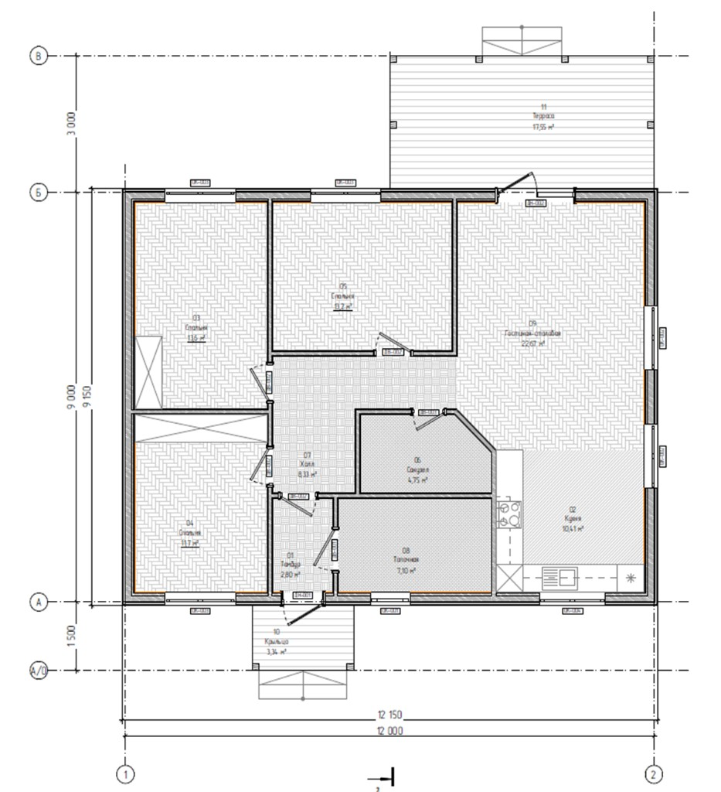

# Комнаты и зоны

Каркас помещений для освещения, климата, безопасности и медиа. **Имена зон** совпадают с полем **Description** точек доступа в Notion **WiFi** / `sources/Ruckus.conf` (кроме случаев, когда в Notion **Комнаты** для номера плана задано другое английское имя — тогда приоритет у **Комнаты**). Матрица «устройство → зона» — ниже. Первичный источник в Notion — **[Комнаты](https://www.notion.so/35e50b4d730481d98c42c88fecbe07e1)** (родитель — [Документация к Умному дому](https://www.notion.so/35e50b4d7304808a9c55ff5bfd567ded)).

**Каналы NVR** — Notion **[Video and Security](https://www.notion.so/35e50b4d73048176aa7fc37e7e709459)** и `03-security.md`.

---

## Планировка жилого дома (архитектурная схема)

Источник: генплан одноэтажного дома с нумерацией помещений **01–11**. Файл в репозитории — [`assets/floor-plan-level-1.png`](assets/floor-plan-level-1.png).

### Габариты (по чертежу)

| Что | Значение |
|-----|----------|
| Тело дома | **12 150 × 9 150** мм |
| Терраса (вынос) | **+3 000** мм к глубине (сторона террасы) |
| Крыльцо (вынос) | **+1 500** мм |

### Расшифровка номеров помещений (к карте / изображению)

Как в Notion **Комнаты**.

| № | Помещение (RU) | Зона (EN) | Площадь, м² | Примечания |
|---|----------------|-----------|-------------|--------------|
| **01** | Тамбур | **Hallway** | 2,80 | |
| **02** | Кухня | **Kitchen** | 10,41 | |
| **03** | Спальня C | **Living Room C** | 13,15 | |
| **04** | Спальня L | **Living Room L** | 11,17 | |
| **05** | Спальня F | **Living Room F** | 13,21 | |
| **06** | Санузел | **Bathroom** | 4,75 | |
| **07** | Холл | **Corridor** | 8,33 | |
| **08** | Топочная | **Boiler Room** | 7,10 | Бойлерная, аппаратная |
| **09** | Гостиная | **Dining Room** | 22,67 | |
| **10** | Крыльцо | **Doorstep** | 3,34 | вход |
| **11** | Терраса | **Terrace** | 17,55 | вход |

### Связь номеров плана с зонами в таблицах ниже

| № плана | Зона |
|---------|------|
| **08** | **Boiler Room** |
| **06** | **Bathroom** |
| **02** | **Kitchen** |
| **09** | **Dining Room** |
| **03**–**05** | **Living Room C** / **Living Room L** / **Living Room F** (см. привязку AP) |
| **07** | **Corridor** |
| **11** | **Terrace** |
| **01** | **Hallway** (тамбур) |
| **10** | **Doorstep** (крыльцо) |

Остальные строки таблицы «Список помещений» (**Greenhouse**, **Bathhouse**, **Cabin** и т.д.) относятся к **участку в целом**, а не к плану этого дома.

---

## Список помещений

Как в Notion **Комнаты** (колонки-заглушки «—» заполняются по мере сценариев).

| Комната/Зона | Помещение (RU) | Этаж | Тип | Освещение | Климат | Безопасность | Медиа | Примечания |
|--------------|----------------|------|-----|------------|--------|--------------|-------|------------|
| **Greenhouse** | Теплица | 1 | Рабочая | — | — | — | — | |
| **Bathhouse** | Баня | 1 | Влажная | — | — | — | — | коммутатор **Dahua DH-CS4006** (см. **Network**) |
| **Bathhouse** | Баня | 2 | Жилая | — | — | — | — | |
| **Cabin** | Бытовка | 1 | Служебная | — | — | — | — | **ISW16803**, LTE; ворота — **Video and Security** / `08-ecosystem.md` |
| **Doorstep** | Крыльцо | 1 | Проходная / наружная | — | — | — | — | план **10** |
| **Hallway** | Тамбур | 1 | Проходная | — | — | — | — | план **01** |
| **Boiler Room** | Бойлерная | 1 | Служебная | — | — | — | — | NVR, AX Pro, стойка |
| **Corridor** | Холл | 1 | Проходная | — | — | — | — | план **07** |
| **Living Room L** | Спальня L | 1 | Жилая | — | — | — | — | AP **ch-int-ap-02** |
| **Living Room C** | Спальня C | 1 | Жилая | — | — | — | — | AP **ch-int-ap-04** |
| **Living Room F** | Спальня F | 1 | Жилая | — | — | — | — | AP **ch-int-ap-03** |
| **Bathroom** | Санузел | 1 | Влажная | — | — | — | — | |
| **Kitchen** | Кухня | 1 | Жилая | — | — | — | — | |
| **Dining Room** | Столовая | 1 | Жилая | — | — | — | — | AP **ch-int-ap-01**; в Notion для плана **09** зона EN — **Dining Room** |
| **Terrace** | Терраса | 1 | Проходная / наружная | — | — | — | — | |

---

## IoT по зонам (инвентаризация и план)

**Контур умного дома:** VLAN **10** (`10.254.10.0/24`), шлюз **10.254.10.1**; **Wiren Board** `ch-wirenboard` **10.254.10.2**; **Home Assistant** `ch-smart` **10.254.10.3**; LoRaWAN **CH-L2-Gate** **10.254.10.5** — [`07-wirenboard.md`](07-wirenboard.md), [`01-network.md`](01-network.md), [`08-ecosystem.md`](08-ecosystem.md).

| Зона | № плана | Сеть (Wi‑Fi / LAN) | Охрана, видео, домофон | Контур IoT |
|------|---------|-------------------|------------------------|------------|
| **Greenhouse** | — | — | Канал **D6** NVR — **Теплица** | Климат, полив — **план** |
| **Bathhouse** (1F) | — | AP **ch-ext-ap**; LAN **Dahua DH-CS4006** | **D1** — баня; **DS-KH6350** `10.254.50.21` | Влажность, освещение — **план** |
| **Bathhouse** (2F) | — | **ch-ext-ap** | уточнить | **план** |
| **Cabin** | — | LTE **ch-router-lte**; LAN **ISW16803** | **D2/D7** — бытовка; порты Ge1/1–1/3 VLAN 50 | Ворота — `08-ecosystem.md` |
| **Hallway** | **01** | ближайшие **ch-int-ap-*** | **DS-KH9510** `10.254.50.19` — тамбур (Notion) | **план** |
| **Corridor** | **07** | ближайшие **ch-int-ap-*** | — | **план** |
| **Boiler Room** | **08** | стойка | **NVR**, **AX Pro**; **D4** — бойлерная | Газ, котёл — `08-ecosystem.md` |
| **Living Room C** | **03** | **ch-int-ap-04** | нет выделенного канала NVR | **план** |
| **Living Room L** | **04** | **ch-int-ap-02** | нет выделенного канала NVR | **план** |
| **Living Room F** | **05** | **ch-int-ap-03** | нет выделенного канала NVR | **план** |
| **Dining Room** | **09** | **ch-int-ap-01** | см. **Video** (план **09** в Notion — «гостиная», зона EN **Dining Room**) | **план** |
| **Kitchen** | **02** | зона кухни + соседние AP | — | **план** |
| **Bathroom** | **06** | ближайший AP | — | **план** |
| **Doorstep** | **10** | уточнить | **DS-KV6113**; **D9** — крыльцо | **план** |
| **Terrace** | **11** | уточнить | **D5** — терраса | **план** |

---

## Расширенная информация (план)

- **Освещение / климат / медиа** — по мере сценариев; **сеть** — Notion **Network**, **WiFi**, **Voice**.
- **Видео** — Notion **Video and Security**.

### Размещение сети и серверной (инвентаризация)

| Узел / роль | Зона | Примечание |
|-------------|------|------------|
| FortiGate, Cisco, стойка, **PVE**, **NVR**, **AX Pro** | **Boiler Room** | |
| **ISW16803**, **MikroTik** LTE | **Cabin** | |
| **Dahua DH-CS4006** | **Bathhouse** (1F) | |

---

## Привязка устройств к комнатам

### Wi‑Fi (`sources/Ruckus.conf`)

| AP | Модель | Зона (Description) |
|----|--------|---------------------|
| **ch-ext-ap** | T350D | Bathhouse (outdoor) |
| **ch-int-ap-01** | R550 | Dining Room |
| **ch-int-ap-02** | R550 | Living Room L |
| **ch-int-ap-03** | R350 | Living Room F |
| **ch-int-ap-04** | R350 | Living Room C |

### Видео и домофоны VLAN 50 (Notion **Video** + **Комнаты**)

| Устройство | Hostname | IP | Зона (док) | Расположение (Notion / Video) |
|------------|----------|-----|------------|-------------------------------|
| NVR DS-7616NXI-K2(D) | **ch-dvrec** | `10.254.50.2` | **Boiler Room** | серверная |
| AX Pro | AX Pro | `10.254.50.18` | **Boiler Room** | Бойлерная |
| DS-KH9510 | **CH-KH9510** | `10.254.50.19` | **Hallway** | Тамбур |
| DS-KV6113 | **CH-KV6113** | `10.254.50.20` | Периметр | Калитка |
| IP-камера D9 | — | `10.254.50.9` | **Doorstep** | Крыльцо; на NVR **Offline** — `03-security.md` |
| DS-KH6350 | **CH-KH6350** | `10.254.50.21` | **Bathhouse** | Баня 1 этаж |

### Каналы NVR (имена на NVR — как в Notion **Video**)

| Канал | Имя на NVR | IP | Модель | Локация |
|-------|------------|-----|--------|---------|
| D1 | IPC-50-4 | 10.254.50.4 | DS-2DE2C400MWG-E | Баня |
| D2 | IPC-50-3-1 | 10.254.50.3 | DS-2SE3C404MWG-E/14 | Бытовка |
| D3 | IPC-50-3-2 | 10.254.50.3 | DS-2SE3C404MWG-E/14 | Бытовка |
| D4 | IPC-50-5 | 10.254.50.5 | DS-2DE2C400MWG-E | Бойлерная |
| D5 | IPC-50-6 | 10.254.50.6 | DS-2DE3A400BW-DE/W | Терраса |
| D6 | IPC-50-10 | 10.254.50.10 | D2121IR3WV2 | Теплица |
| D7 | IPC-50-8 | 10.254.50.8 | D2121IR3V2 | Бытовка |
| D8 | DS-2CD20 | 10.0.50.5 | DS-2CD2023G0E-I | HQ (Офис) |
| D9 | IPC-50-9 | 10.254.50.9 | DS-2CD2346G2P-ISU/SL | Крыльцо |

**Вне D1–D9 на NVR:** `10.254.50.7` — **DS-2CD2023G2-IU** — см. `03-security.md`.

Коммутатор **ISW16803** в **Cabin**; порты **Ge1/1–1/3** — VLAN 50; **description портов пустой**.

### Голос (справочно)

3CX — VLAN 20; см. Notion **Voice** и `04-voice.md`.
